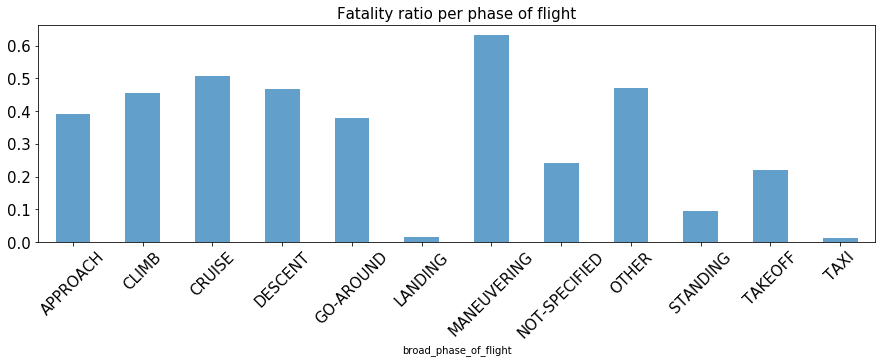

# Fatality of aircraft accidents

#### Classification project for prediction of fatality of aircraft accidents

[Link to detailed presentation on Google Slides](https://docs.google.com/presentation/d/1g3BPQ9ScmeEkoQKmkWdoELarZnPAcgZ-k6WamtbHxGo/edit?usp=sharing)

Utilized machine learning algorithms to predict fatality of aircraft accidents based on various features regarding the event

+ Build unique dataset from the NTSB API and utilized Pandas for data structuring.
+ Imputation of missing values was based on domain knowledge
+ Deployed logistic regression, random forest and boosted methods to identify the best model
+ Used Confusion Matrix, Precision, Recall and ROC-AUC scores for model performance comparison

## Project description
Between 2008 and 2017 over 13000 aircraft accidents took place in United States and over 2000 of them were fatal. In this project I wanted to answear the question:

*Is it possible to predict whether the accident was fatal comparing the aircraft type, damage severity, weather condition and other available data?*

Data were gathered from National Transportation Safety Board website through open database API calls. It consisted of information from over 76000 aircraft accident reports. I decided to focus on data from between 2008 and 2017, to have the most current information which were available. 

Features which were used as predictors

* Aircraft type
* Phase of flight
* Severity of damage
* Weather condition
* Engine type
* Date of event

and others.

**Jupyter notebooks summary**:

+ Getting-and-cleaning-the-data.ipynb - API calls, imputation of missing values, feature engineering
+ Fatality\_binary\_classification.ipynb - Fatality of aircraft accident binary classification problem modeling
+ Multiclass\_phase\_of\_flight\_classification.ipynb - Classificatiion of phase of flight during which the accident happened - multiclass classification problem

### Exploratory Data Analysis

Fatality of accidents          |  Accidents by phase of flight
:-------------------------:|:-------------------------:
 |  

Out of all aircraft accidents that happened in United States 81% of them were non-fatal and less than 2% of them resulted in death of more than 3 persons.

Statistics show that most of the accidents happen during first and last few minutes of flight - mainly during take-off and landing.

Number of all accidents have been consistently decreasing since 1982.

To verify if there is any influence of available features on fatality of accidents I calculated a fatality ratio as a number of fatal accidents divided by number of all accidents that happened with selected feature.

Below you can see the fatality ratio per phase of flight during which the accident happened. Despite the fact that 27% of all accidents were during landing, this phase has also lowest count of people that didn't survive.

<!---->
 

Verification of the month in which the accident happened showed that most of them take place during summer months as people are traveling for vacation. Depite that highest count of deaths is during the winter months.

  
   

### Fatality classification modeling

First model that I used for prediction of fatality of aircraft accidents was the logistic regression. Model was performing very well at predicting non-fatal events (0 at confusion matrix) and the accuracy was at the level of 87%, but the it wasn't handling well the prediction of the fatality. F1 score - the average test accuracy balancing precision and recall was at the level of 53%.
The  ROC-AUC Score - ability of a binary classifier system  at various thresholds settings -  was at the level of 0.85.

  
   

To improve the accuracy of the classification problem I decided to handle the class imbalance. Three different approaches to this issue were checked: Upsampling, Downsampling and SMOTE. All of them were tested with baseline logistic regression model. Upsampling was the best performing approach and was used for further modeling.

<!---->
 

To find the best perofrming model I run multiple different classification algorithms - Random Forest, AdaBoost, Gradient Boosting, XGBoost. Grid search with a group of varying parameters were run for each of the models.

In the table below you can find the summary of their results. All of the results are the average values from the cross validation.

<!---->

 

Random Forest model with 13 different predictors outperformed any other model increasing predicting accuracy to 95%. 
All models showed big influence of severity of the damage and phase of flight in which accident happened on fatality of the event.

<!--
-->

  
   

This results seems like the model is overfitting to the data and will need to be checked on future datapoints.

### Multiclass classification problem

Classification of phase of flight during which the accident happened is a multiclass classification problem. In this approach I used fatality of the event as one of the features for prediction. There were 13 phase of flight classes to predict in total.

Similar as in binary problem as a baseline model I used Logistic Regression. The accuracy of the first model was at the level of 37% and F1-score - 30%. As value of accuracy score can be thought of as much better than random choice - with 13 classes random choice would be around 8% - F1 score tells us that the results are not balanced.

Next models that I tested to find the best classifier were as previously Random Forest, AdaBoost, GradientBoosting and XGBoost. Though, none of them would give much better results than simple logistic regression. Below you can see an example of confusion matrix generated for this problem. As you can see model is not performing very well with predicting classes other than take-off and landing. It is due to high class imbalance and not enough information from the predictors that could give reasonable results.

 